**sklearn使用与机器学习回归**

| **学号** |      | **姓名** |      | **电话** |      |
| -------- | ---- | -------- | ---- | -------- | ---- |
|          |      |          |      |          |      |

## **一、** ***\*实验目的\****

通过实验，学会机器学习回归和机器学习库sklearn的使用。

具体目标要求如下：

1） 成功安装sklearn。

2） 掌握scikit-learn的基本用法，包括数据预处理、模型训练和预测。

3） 学习使用sklearn实现并评估一个回归模型。

## **二、** ***\*实验内容及要求\****

**本次实验在mo平台中完成，请同学们在mo平台中创建ipynb文件完成实验。**

 

 

|      |                             |
| ---- | --------------------------- |
|      | 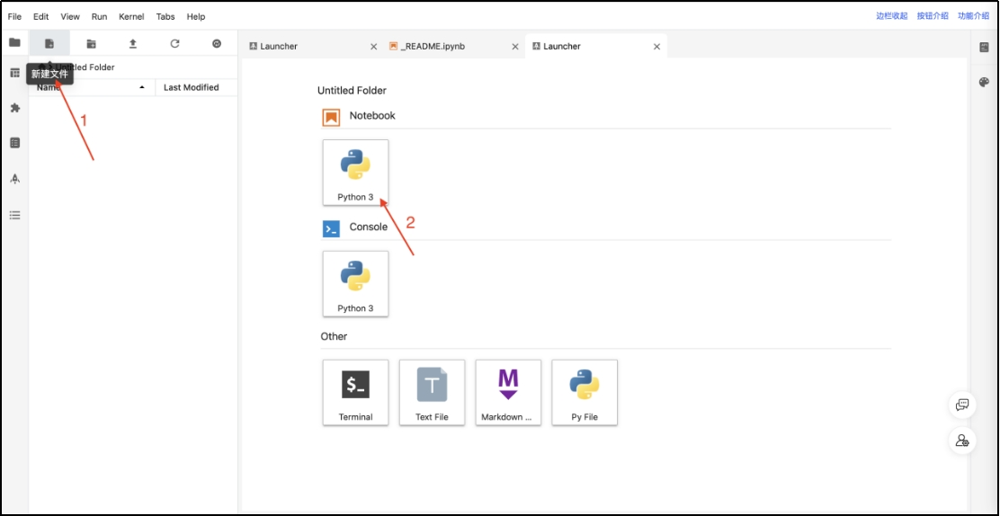 |

**实验步骤（仔细阅读，按照步骤完成实验）**

### 1. **sklearn安装** 

（1） 

|      |                             |
| ---- | --------------------------- |
|      |  |

运行以下命令安装sklearn。

### 2. **sklearn基本用法**

***\*参考资料：\****https://scikit-learn.org/stable/index.html

首先，我们随机生成一组自变量 x的数据，并在此基础上通过添加随机噪声来构建 y。这样，我们可以模拟实际情况中可能存在的测量误差或其他干扰因素，以便拟合模型 y=3x+2。

通过这种方法，我们旨在评估回归模型在面对真实数据时的表现和预测能力。

（1） 

|      |                             |
| ---- | --------------------------- |
|      | 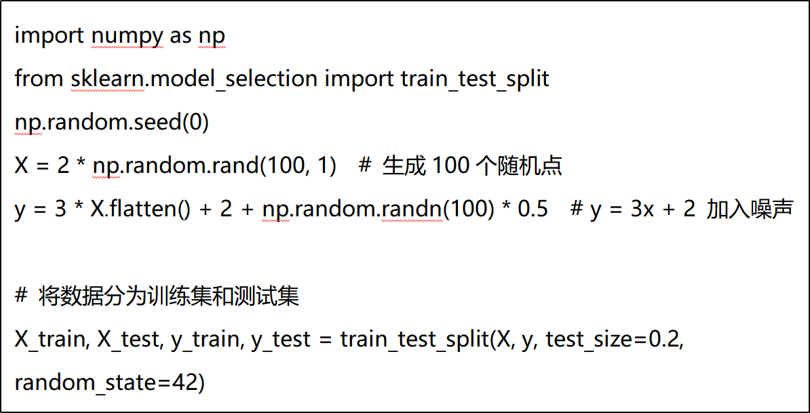 |

数据生成与预处理

（2） 模型训练

|      |                             |
| ---- | --------------------------- |
|      | 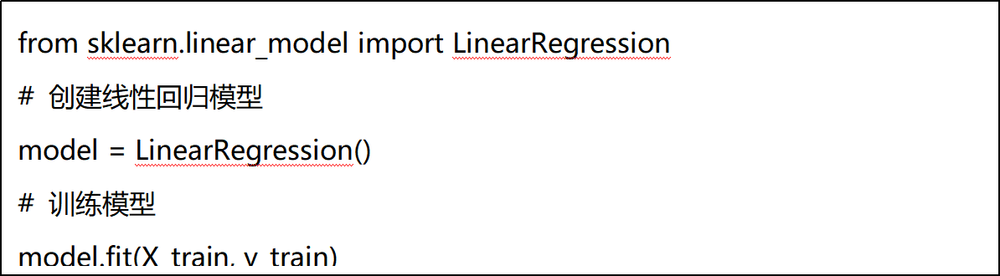 |

 

（3） 

|      |                             |
| ---- | --------------------------- |
|      | 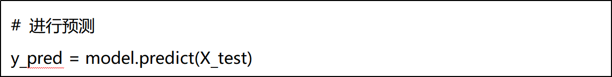 |

模型预测

（4） 模型评估：

|      |                             |
| ---- | --------------------------- |
|      | 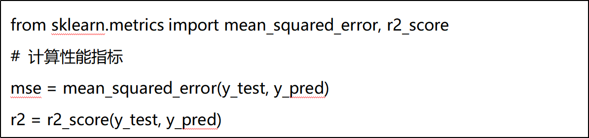 |

使用测试集评估模型的性能，比如计算均方误差（MSE）或决定系数（R²）。

 

（5） 

|      |                             |
| ---- | --------------------------- |
|      | 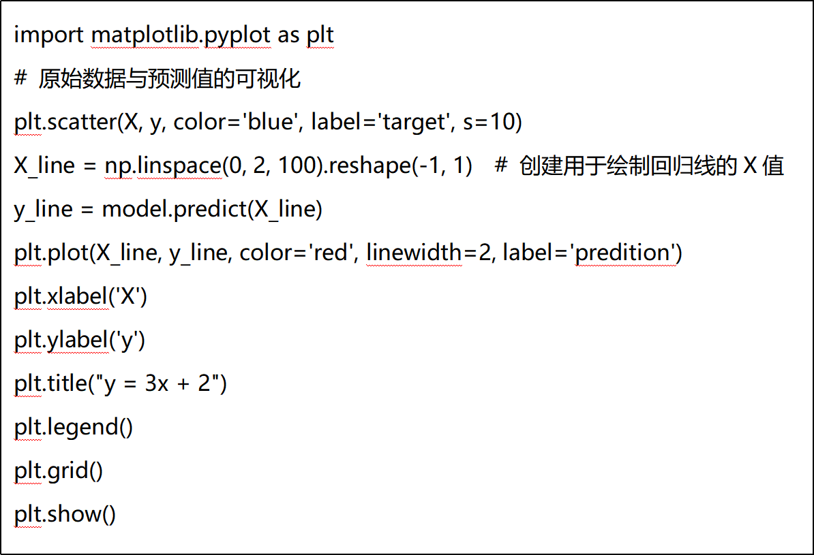 |

可视化

### **3.** ***\*波士顿房价预测实例\****

本实验将使用波士顿房价数据集。该数据集包含不同特征（如房间数、房龄、距离市中心的距离等）以及相应的房价信息。目标是构建一个模型来预测房价。

**（1）** ***\*数据加载与探索\****

使用 scikit-learn 提供的工具加载数据，并进行初步探索。

|      |                             |
| ---- | --------------------------- |
|      | 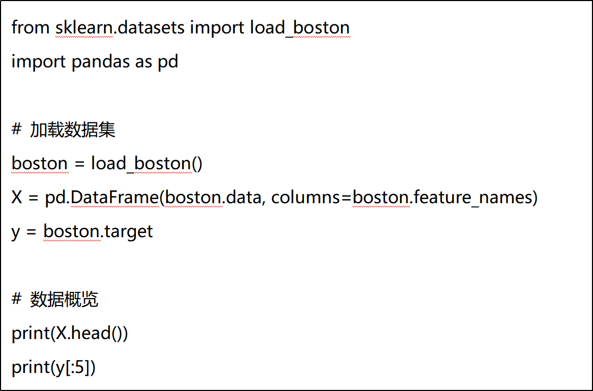 |

 

**（2）** ***\*数据预处理\****

|      |                             |
| ---- | --------------------------- |
|      | 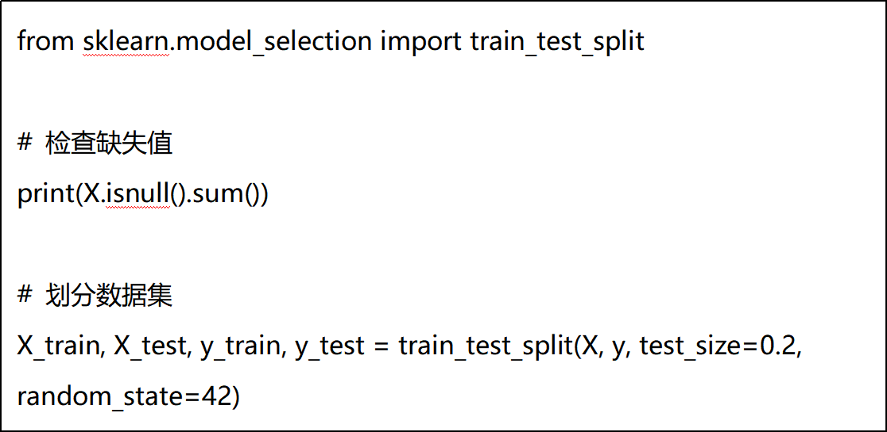 |

在数据预处理阶段，检查数据的基本信息、缺失值，并决定是否填充或删除这些值（波士顿房价数据集中通常没有缺失值），并将数据分为训练集和测试集，使用 80% 的数据用于训练，20% 用于测试：

**（3）** ***\*模型训练\****

创建线性回归模型，并用训练数据进行拟合

|      |                              |
| ---- | ---------------------------- |
|      | 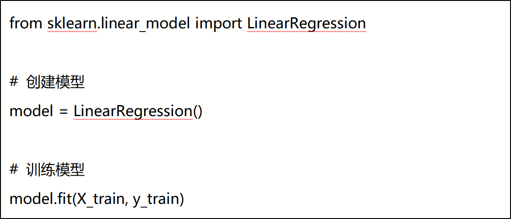 |

 

**（4）** ***\*模型评估\****

在模型评估阶段，对测试集进行预测，并计算模型性能指标（如均方误差 MSE 和决定系数 R²）：

**（5）** 

|      |                              |
| ---- | ---------------------------- |
|      | 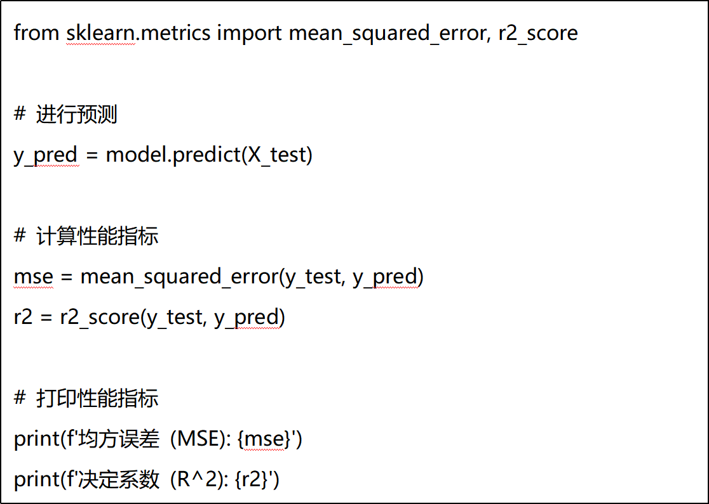 |

***\*可视化结果：\****

通过绘制真实值与预测值的散点图，直观展示模型的拟合效果：

 

 

|      |                              |
| ---- | ---------------------------- |
|      | 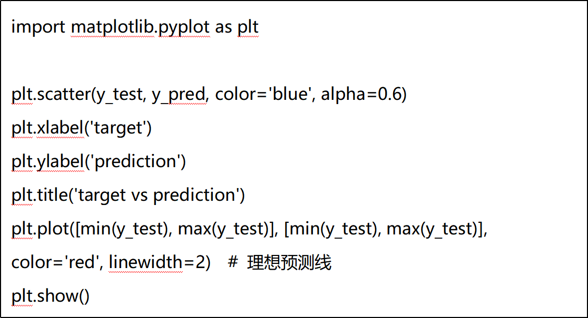 |

 

 

 

 

 

 

 

 

 

 

 

 

 

 

 

 

 

### **4.** ***\*乳腺癌检测实例\****

在本案例中，我们将使用经典的乳腺癌数据集（Breast Cancer Dataset）进行乳腺癌检测预测。该数据集包含569个样本，每个样本有30个特征，并标记为良性（0）或恶性（1）。我们的目标是使用这些特征训练一个逻辑回归模型，预测新的样本是良性还是恶性。

**（1）** ***\*数据加载与探索\****

使用 scikit-learn 提供的工具加载数据，并进行初步探索。

|      |                              |
| ---- | ---------------------------- |
|      |  |

 

**（2）** ***\*数据预处理\****

|      |                              |
| ---- | ---------------------------- |
|      | 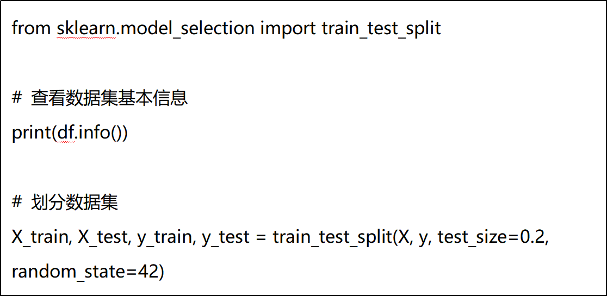 |

在数据预处理阶段，检查数据的基本信息、缺失值，并决定是否填充或删除这些值（乳腺癌数据集中通常没有缺失值），并将数据分为训练集和测试集，使用 80% 的数据用于训练，20% 用于测试：

**（3）** ***\*模型训练\****

使用逻辑回归模型进行训练，设置最大迭代次数以确保收敛。

|      |                              |
| ---- | ---------------------------- |
|      | 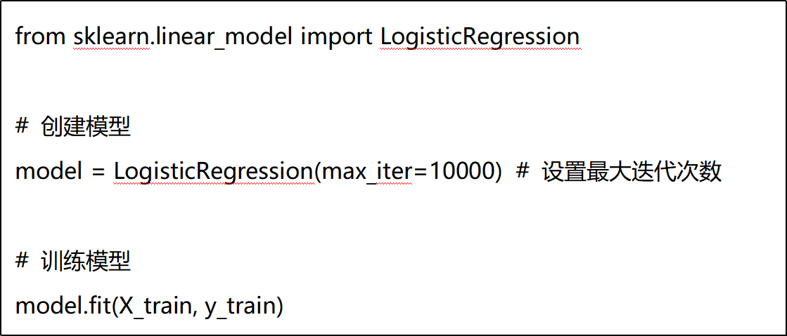 |

**（4）** ***\*模型评估\****

在模型评估阶段，对测试集进行预测，并计算模型的准确率，输出混淆矩阵，了解分类效果。

**（5）** 

|      |                              |
| ---- | ---------------------------- |
|      | 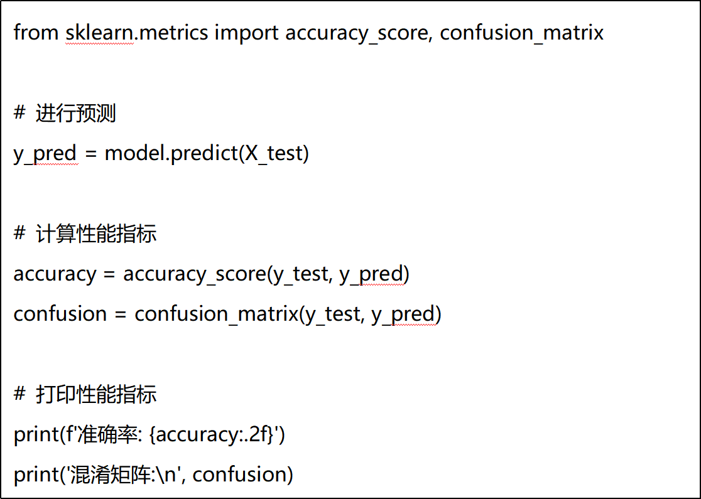 |

***\*可视化结果：\****

|      |                              |
| ---- | ---------------------------- |
|      | 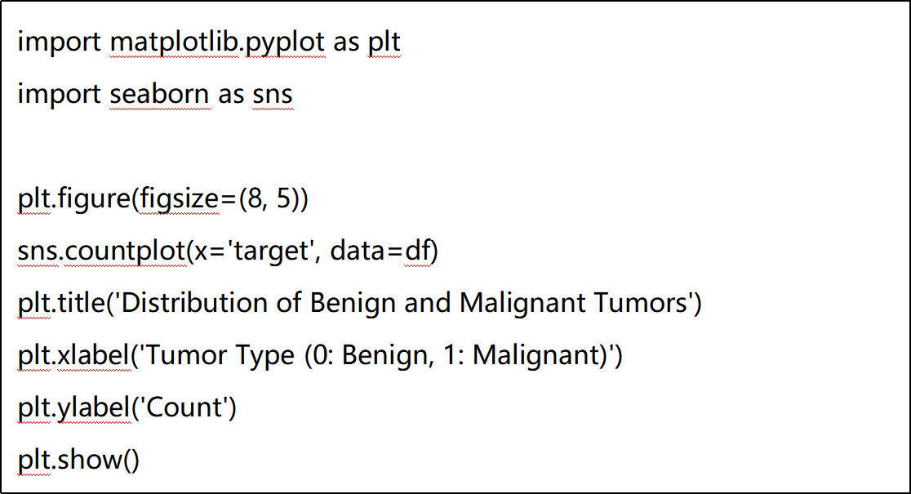 |

 

 

 

 

 

**作业上交内容与事项****：**

1．在mo平台中创建ipynb文件完成实验，可适当添加文字描述，文件命名格式为姓名_学号.ipynb；

 

2．请在截止日期内提交。

**本次作业上交内容：**

l 实验报告文档. ipynb

 