**机器学习之无监督学习**

## **一、** ***\*实验目的\****

通过实验，理解梯度下降，学会应用无监督学习技术。具体目标要求如下：

1） 实现梯度下降算法

2） 学会应用聚类算法对数据集进行聚类，探索数据的潜在分类结构。

3） 学会运用降维技术，便于数据可视化和理解。

## **二、** ***\*实验内容及要求\****

|      |                              |
| ---- | ---------------------------- |
|      | 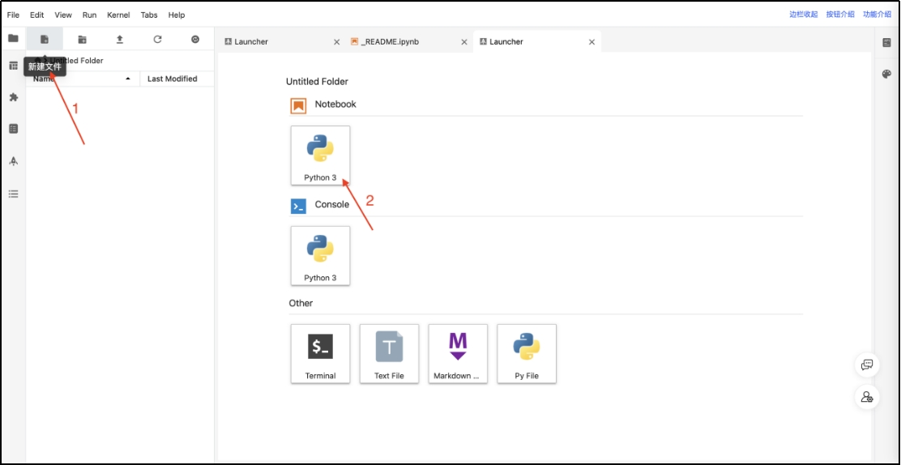 |

**本次实验在mo平台中完成，请同学们在mo平台中创建ipynb文件完成实验。**

 

 

 

 

 

**实验步骤（仔细阅读，按照步骤完成实验）**

### 1. **梯度下降**

梯度下降是一种经典而广泛应用的优化算法，主要用于最小化损失函数，通过逐步调整模型参数来提高预测性能。我们可以通过模拟梯度下降的过程来深入理解梯度下降。

（1） 

|      |                              |
| ---- | ---------------------------- |
|      | 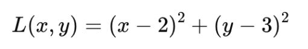 |

***\*损失函数定义：\****我们选择一个二次函数作为损失函数，其形式为：

|      |                              |
| ---- | ---------------------------- |
|      | 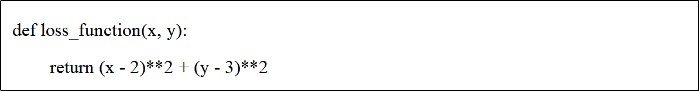 |

该函数的最小值位于点 (2, 3)，这是我们希望通过梯度下降算法找到的目标。

（2） 

|      |                              |
| ---- | ---------------------------- |
|      | 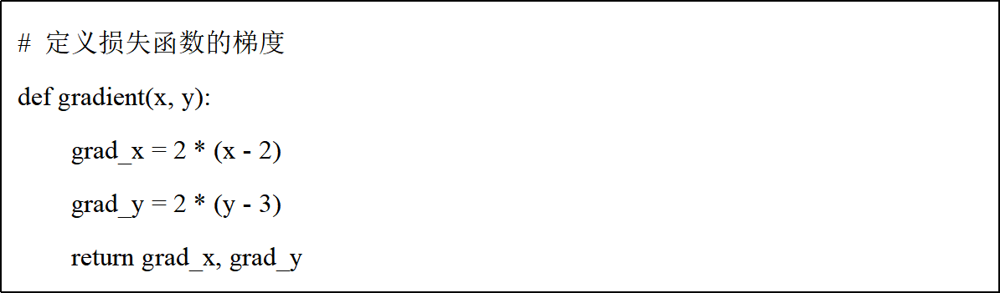 |

|      |                              |
| ---- | ---------------------------- |
|      | 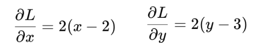 |

***\*梯度计算\*******\*：\****损失函数的梯度可以通过对函数求偏导得到，用于指导梯度下降过程中的更新方向。

**（3）** ***\*梯度下降算法\*******\*定义\****

我们实现了梯度下降算法，步骤如下：

1. 初始化起始点和学习率。

**2.** 

|      |                              |
| ---- | ---------------------------- |
|      | 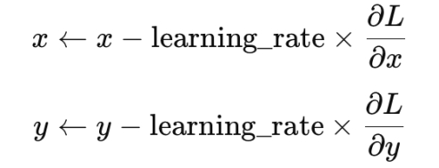 |

在每次迭代中，根据当前点的梯度更新坐标：

3. 记录每一步的坐标，以便后续可视化。

|      |                              |
| ---- | ---------------------------- |
|      | 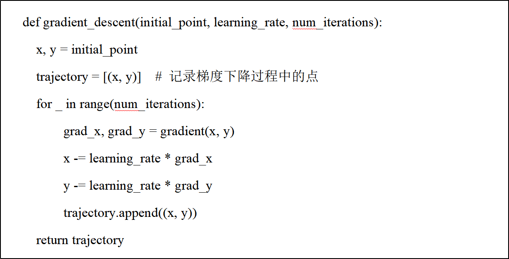 |

（4） 

|      |                              |
| ---- | ---------------------------- |
|      | 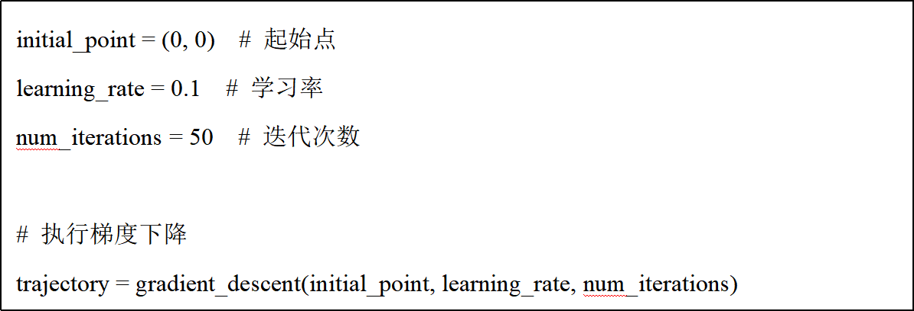 |

***\*梯度下降算法实现\****

（5） 

|      |                              |
| ---- | ---------------------------- |
|      | 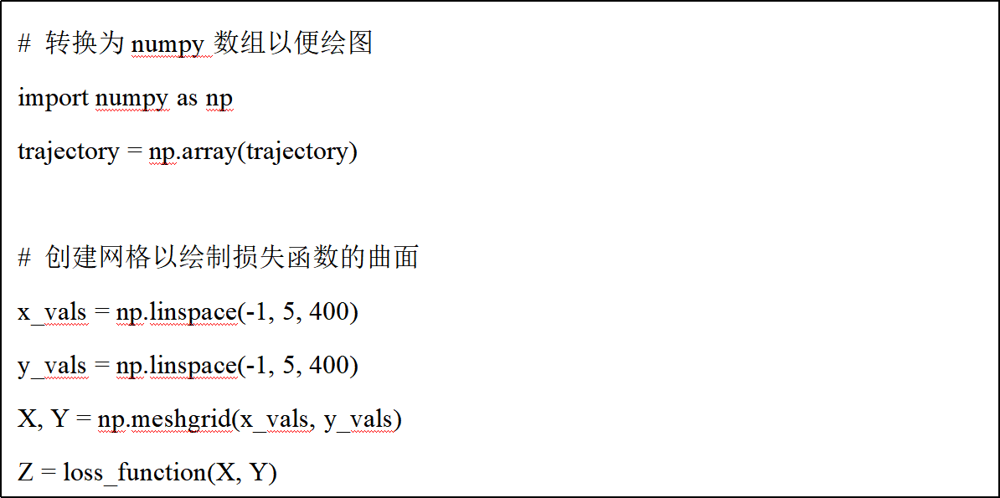 |

***\*可视化结果\****

|      |                              |
| ---- | ---------------------------- |
|      |  |

 

 

### 2. **聚类  K-means**

***\*参考资料：\****[https://scikit-learn.org/stable/modules/clustering.html#k-means](#k-means)

在鸢尾花例子中，聚类就像是在没有任何先验知识的情况下，仅仅根据花的特征（花萼和花瓣的长度和宽度）来将它们分类。

**（1）** 

|      |                              |
| ---- | ---------------------------- |
|      | 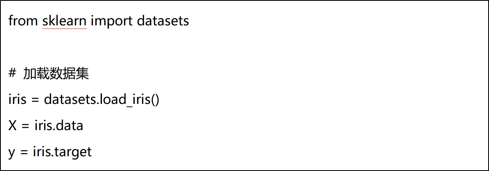 |

***\*数据加载\****：X包含特征数据（萼片和花瓣的长度和宽度），y包含真实的类别标签。

**（2）** 

|      |                              |
| ---- | ---------------------------- |
|      | 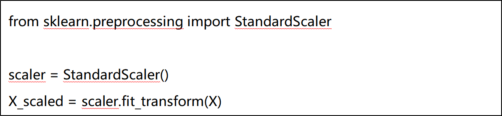 |

***\*数据标准化：\****标准化的目的是将所有特征调整到相同的尺度，这对K-means算法很重要，因为它基于距离计算。

**（3）** 

|      |                              |
| ---- | ---------------------------- |
|      | 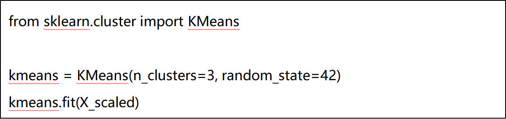 |

***\*模型\*******\*创建与训练：\****指定簇的数量为3（因为鸢尾花有3个品种）。random_state=42确保结果可重复。

（4） 

|      |                              |
| ---- | ---------------------------- |
|      | 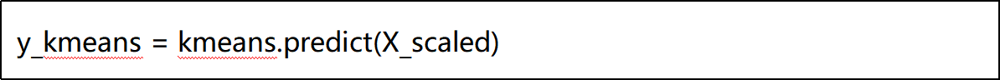 |

***\*模型预测：\****predict方法将每个数据点分配到最近的簇。y_kmeans包含每个数据点的簇标签。

|      |                              |
| ---- | ---------------------------- |
|      | 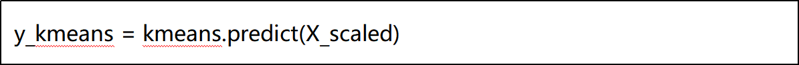 |

 

**（5）** 

|      |                              |
| ---- | ---------------------------- |
|      |  |

***\*可视化\****：创建两个子图：左图显示原始数据的真实类别，右图显示K-means聚类的结果。我们只使用前两个特征（萼片长度和宽度）来创建2D散点图。

（6） 模型评估

|      |                              |
| ---- | ---------------------------- |
|      | 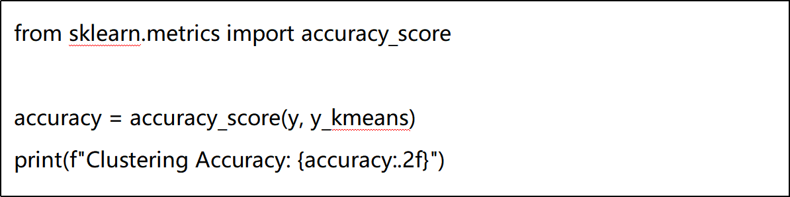 |

计算聚类的准确率。需要注意的是，K-means是一种无监督学习算法，通常不会用准确率来评估。但在这个例子中，由于我们知道真实的类别标签，所以可以用它来了解聚类效果。

（7） 

|      |                              |
| ---- | ---------------------------- |
|      | 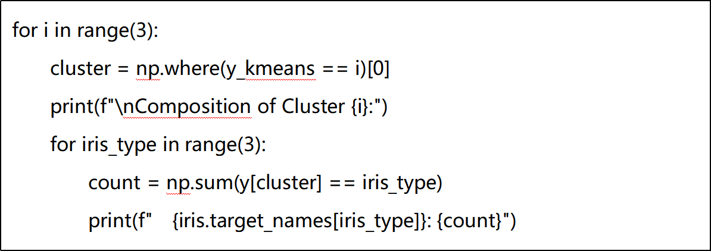 |

分析簇的组成

### **3.** ***\*降维\****

***\*参考资料：\****[https://scikit-learn.org/stable/modules/generated/sklearn.decomposition.PCA.html#sklearn.decomposition.PCA](#sklearn.decomposition.PCA)

鸢尾花数据集有四个特征：花萼长度、花萼宽度、花瓣长度和花瓣宽度。我们可以想象三维空间，但四维空间超出了我们的直觉。主成分分析（Principal Component Analysis，PCA）要做的就是试图找到数据变化最大的方向（我们称之为主成分），然后用这些方向来表示数据。

**（1）** ***\*数据加载\****

|      |                              |
| ---- | ---------------------------- |
|      | 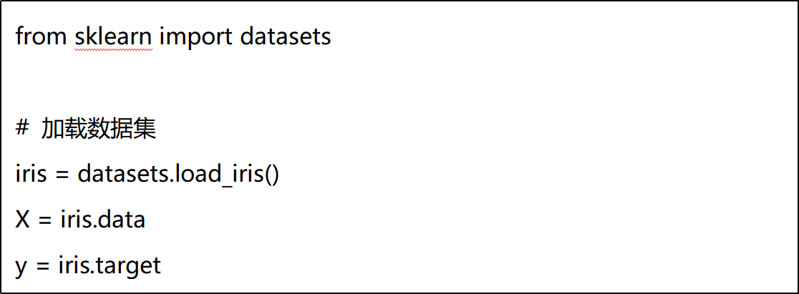 |

（2） 

|      |                              |
| ---- | ---------------------------- |
|      |  |

***\*数据标准化\****

（3） 

|      |                              |
| ---- | ---------------------------- |
|      |  |

***\*应用PCA：\****这里我们创建了一个PCA对象，并使用fit_transform方法对标准化后的数据进行转换。X_pca就是转换后的数据，其中每一列对应一个主成分。

（4） 

|      |                              |
| ---- | ---------------------------- |
|      | 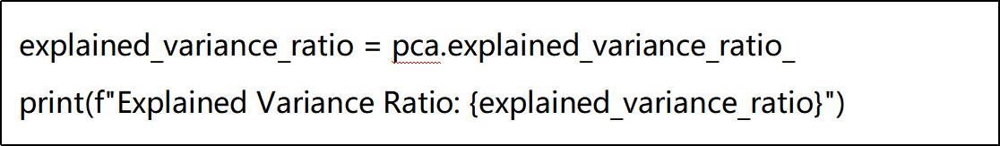 |

***\*分析主成分：\****explained_variance_ratio_告诉我们每个主成分解释了多少比例的方差。通过查看 explained_variance_ratio_，可以决定选择多少个主成分以保留足够的方差（通常选择累积方差达到 90% 或 95%）。

**（5）** ***\*分析主成分的组成\*******\*：\****打印出每个主成分的特征向量,表示每个原始特征对主成分的贡献。然后计算并打印原始特征与主成分的相关性。这告诉我们每个主成分与原始特征的关系强度和方向。

|      |                              |
| ---- | ---------------------------- |
|      | 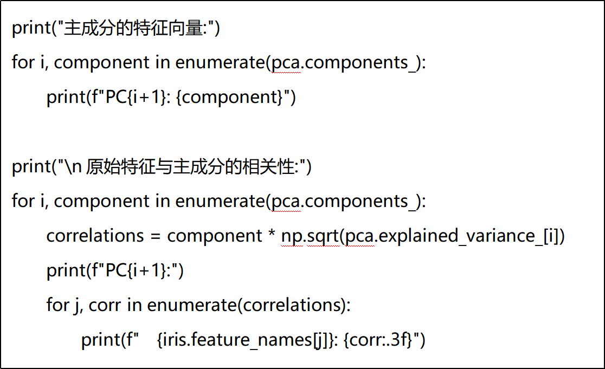 |

 

 

 

 

**作业上交内容与事项****：**

1．在mo平台中创建ipynb文件完成实验，可适当添加文字描述，文件命名格式为姓名_学号.ipynb；

 

2．请在截止日期内提交。

**本次作业上交内容：**

l 实验报告文档. ipynb

 

 

## ***\*三、实验感受与记录\****

3.1 实验感受**（总结实验过程中的收获或疑问）**

 

 

 

3.2 实验记录

（以下填写实验操作过程产生的内容，包括文字和适当截取的中间操作图片）

 

 